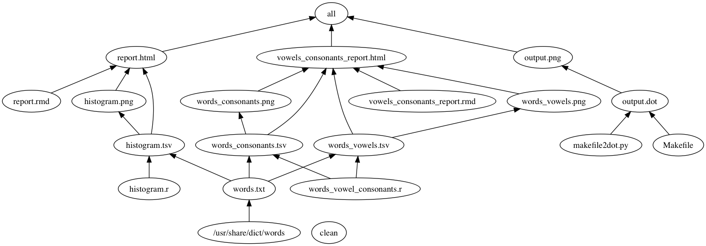

# Make Activity
=============

## Important links

|               | Quick and important links|
| ------------- |-------------|
|  :heavy_check_mark: | [Makefile](https://github.com/STAT545-UBC-students/hw09-rachlobay/blob/master/Makefile)| 
|  :heavy_check_mark: | [makefile2dot.py (for generating graph of homework pipeline)](https://github.com/STAT545-UBC-students/hw09-rachlobay/blob/master/makefile2dot.py)| 
|  :heavy_check_mark: | [words_vowel_consonants.R (added R file)](https://github.com/STAT545-UBC-students/hw09-rachlobay/blob/master/words_vowel_consonants.R)| 
|  :heavy_check_mark: | [vowels_consonants_report.md (added .md file)](https://github.com/STAT545-UBC-students/hw09-rachlobay/blob/master/vowels_consonants_report.md)| 
|  :heavy_check_mark: | [vowels_consonants_report.Rmd (added .Rmd file)](https://github.com/STAT545-UBC-students/hw09-rachlobay/blob/master/vowels_consonants_report.Rmd)| 
|  :heavy_check_mark: | [vowels_consonants_report.html (added .html file)](https://github.com/STAT545-UBC-students/hw09-rachlobay/blob/master/vowels_consonants_report.html)| 
|  :heavy_check_mark: | [words.txt](https://github.com/STAT545-UBC-students/hw09-rachlobay/blob/master/words.txt)| 

## Table of Contents for the README.md
- [Purpose and objectives of this homework assignment](#purpose-and-objectives-of-this-homework-assignment)
- [Graph of my pipeline for this homework](#graph-of-my-pipeline-for-this-homework)
- [What I changed and added to the original pipeline](#what-I-changed-and-added-to-the-original-pipeline)
    + [R script](#r-script)
    + [Rmd file](#rmd-file)
    + [Graph of the homework pipeline](#graph-of-the-homework-pipeline)
- [End credits](#end-credits)    

## Purpose and objectives of this homework assignment
The purpose of this homework was to change the make acivity pipeline that we worked with in class. 

The objectives of this homework were to make an R script and an Rmd script and add them to the pipeline by tweaking the Makefile. Both the R script and Rmd script should have output. Also, whatever additions I made should be intertwined with the original pipeline. The additions that I made should have been sensible. They should have provided output that led me to analysis that is meaningful and specific to the data that I am working with. The Makefile should be composed so that if some dependency is modified, the output that is produced should be correct and all the downstream elements of the pipeline run appropriately.

Finally, the following commands should work. The make clean command should take away all of the ouput, while the make all command should give all output in the repo (which should not include the pesky Rplots.pdf byproduct). 

## Graph of my pipeline for this homework

## What I changed and added to the original pipeline

### R script

I chose to add a R script that is named words_vowel_consonants.R. The purpose of this R script was to count the number of vowels in each word and count the number of consonants in each word from the file words.txt. To achieve this, I used the `str_count()` function, from the stringr package that we went over in this course a while back. The output of the words_vowel_consonants.R file are two tables - the table words_consonants.tsv that gives the number of words that have 1 consonant, 2 consonants,... etc. and the other table words_vowels.tsv which gives the number of words that have 1 vowel, 2 vowels, 3 vowels, etc. Both the words_vowels.tsv and words_consonants.tsv are dependent on the words.txt file, so I had to include that in the Makefile.

### Rmd file

The .Rmd file that I added is called vowels_consonants_report.Rmd. The tsv files that were produced by words_vowel_consonants.R file are used the as input in this Rmd. This Rmd file communicates the results as ggplot2 qplots. Meaning, Figure 1 is a histogram of the count of vowels in the words, while Figure 2 is a histogram of the count of consonants in the words. I also mention the most common number of vowels and the most common number of consonants underneath the corresponding plot (although those should be pretty clear from the plots).

Under all:, I added vowels_consonants_report.html because that is at the top of the dependency chain. Also,I had to include the new output words_vowels.tsv, words_vowels.png, words_consonants.tsv, words_consonants.png, vowels_cosonants_report.md, vowels_cosonants_report.html, and output.dot under clean: (so they are removed each time I use the make clean command). The plot images words_vowels.png and words_consonants.png are dependent upon their respective .tsv files, so I included those dependencies in the Makefile. Finally, the vowels_consonants_report.Rmd is also output as a .html file. So, in the Makefile part for vowels_consonants_report.html, I noted that the .html file depends on vowels_consonants_report.rmd, words_vowels.tsv, words_vowels.png, words_consonants.tsv, and words_consonants.png.

### Graph of the homework pipeline

I decided to add a graph of my pipeline that is both automatic and reproducible (see above in the README.md). To do this, I modified some of the Makefile code and incorported the makefile2dot.py file in my homework from [here](https://github.com/vak/makefile2dot). So, I added the corresponding Makefile code to produce an image called output.png that is the graph of my pipeline for this homework. 

As prescribed by [here](https://github.com/vak/makefile2dot), I added a section in the Makefile for ALL which had output.dot and output.png in it. Under all:, I included output.png. I added an output.png: section to the Makefile which depends on output.dot. I also put in output.dot which depends on the makefile2dot.py file that is in this repo (originally from [here](https://github.com/vak/makefile2dot)). Finally, I had to include output.dot and output.png under clean: (so they are removed each time I use the make clean command).

## End credits

[This is the original product](https://github.com/STAT545-UBC/make-activity) that my homework repo was seeded with.

Again, I modified some of the Makefile code and used the makefile2dot.py file from [here](https://github.com/vak/makefile2dot) in order to make the graph of my pipeline that is automatic and reproducible (that is visible in the README.md).

