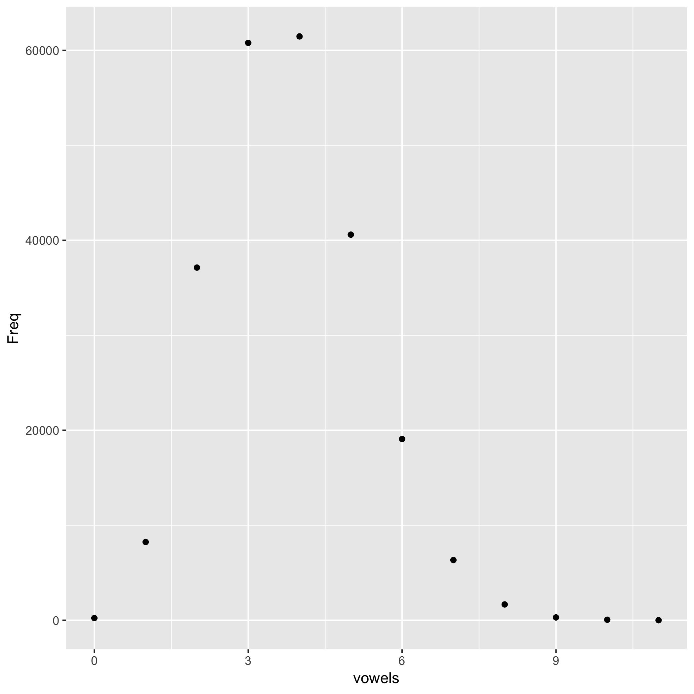
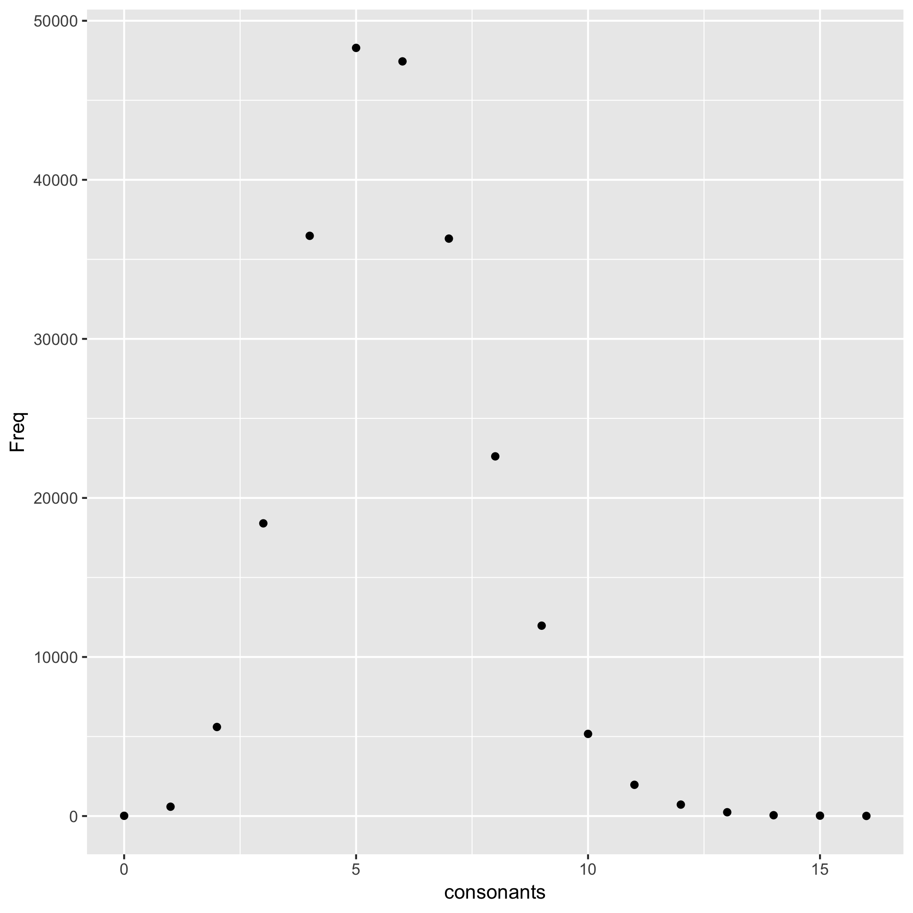

From the  235886 words containted in the attached words.txt file, I computed the number of vowels of each word and tabulated how many words have 1 vowel, 2 vowels, 3 vowels, etc.

The most common number of vowels is 4.

Now, since we looked at the numbers of vowels in the words, naturally we'd also look at the number of consonants in the words. 

The most common number of consonants is 5.
